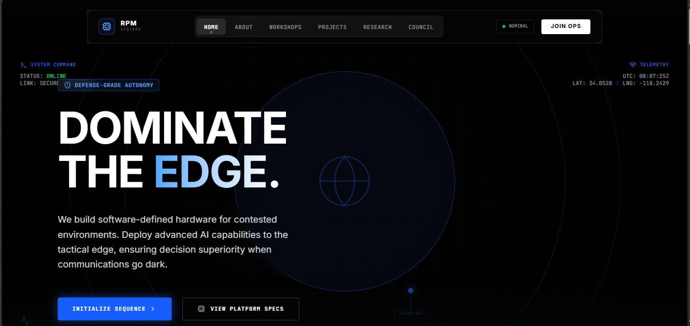
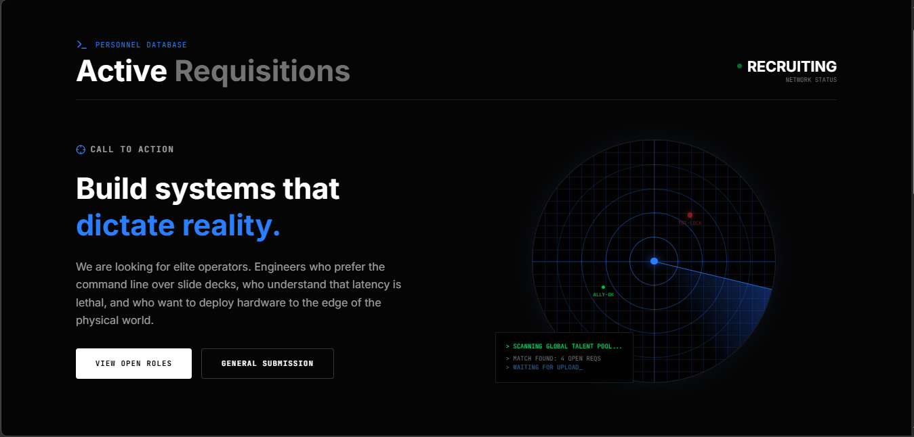

---

# RPM | ROBU: Command Interface

> A high-performance, defense-tech inspired web interface built for the Research and Project Management (RPM) Division.

This repository contains the front-end architecture for the RPM operational dashboard. The design language is strictly utilitarian, prioritizing data density, high-contrast typography, and mechanical interactions over traditional corporate web design.

---

## 📸 System Telemetry (Visuals)

<table>
<tr>
<td align="center">



<em>Home Page</em>
</td>
<td align="center">



<em>Join OPS</em>
</td>
</tr>
</table>

---

## 🛠️ Technological Stack

This platform is engineered for speed, type safety, and fluid physics-based animations.

* **Core Framework:** Next.js (App Router)
* **Language:** TypeScript
* **Styling:** Tailwind CSS (with custom keyframe extensions)
* **Animation Engine:** Framer Motion (Spring-physics interactions)
* **Iconography:** Lucide React (Tactical/Terminal aesthetic)

---

## 📐 Design Language Specifications

The UI strictly adheres to a "defense-grade" design system:

* **Monochromatic Depth:** Pure black (`#020202`) backgrounds with subtle `white/5` structural borders.
* **Monospaced Metadata:** All coordinates, system statuses, timestamps, and data identifiers utilize `JetBrains Mono` to emulate terminal outputs.
* **Hardened Interactions:** Removal of soft shadows and rounded pills. Hover states rely on sharp border sweeps, targeted crosshairs, and rapid pulse animations.
* **Ambient Noise:** Global CSS grids and SVG noise overlays are applied to simulate radar screens and HUDs.

---

## ⚙️ System Initialization (Local Dev)

Follow these steps to spin up the local development server.

### 1. Clone the Repository

```bash
git clone https://github.com/your-org/rpm-robu-interface.git
cd rpm-robu-interface

```

### 2. Install Dependencies

```bash
npm install

```

### 3. Establish Local Uplink

Start the Next.js development server:

```bash
npm run dev

```

The interface will be live and accessible at `http://localhost:3000`.

---

## 📂 Architecture Overview

* `/app` - Next.js routing (Command Hub, Active Requisitions, R&D Vault).
* `/components` - Modular UI pieces (Bento Grids, HUD elements, Topology Scanners).
* `/lib` - Utility functions and raw data structures.
* `/docs` - System documentation and visual assets.

---
